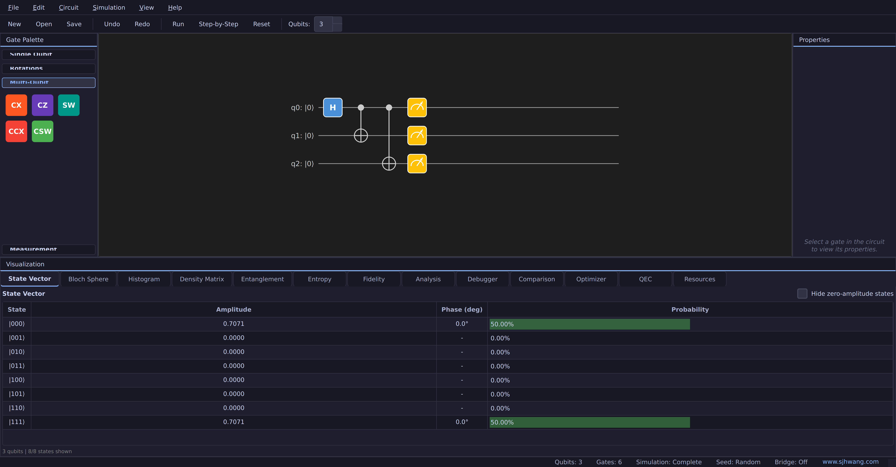
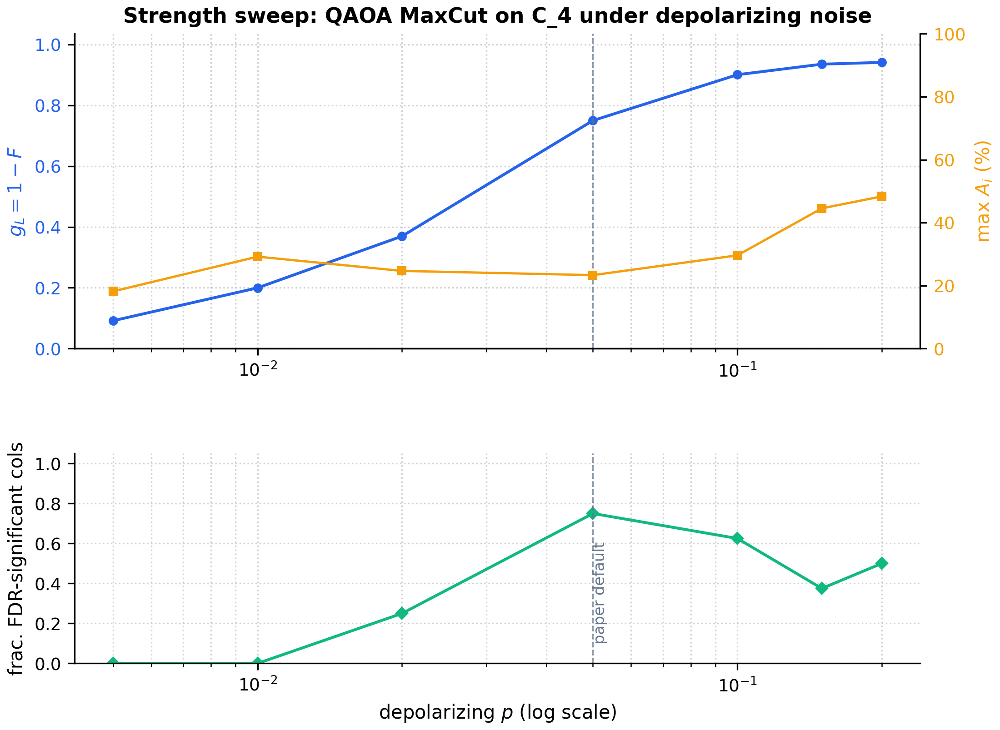
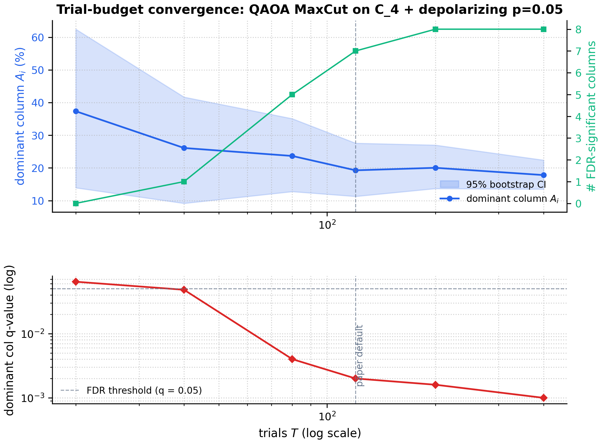
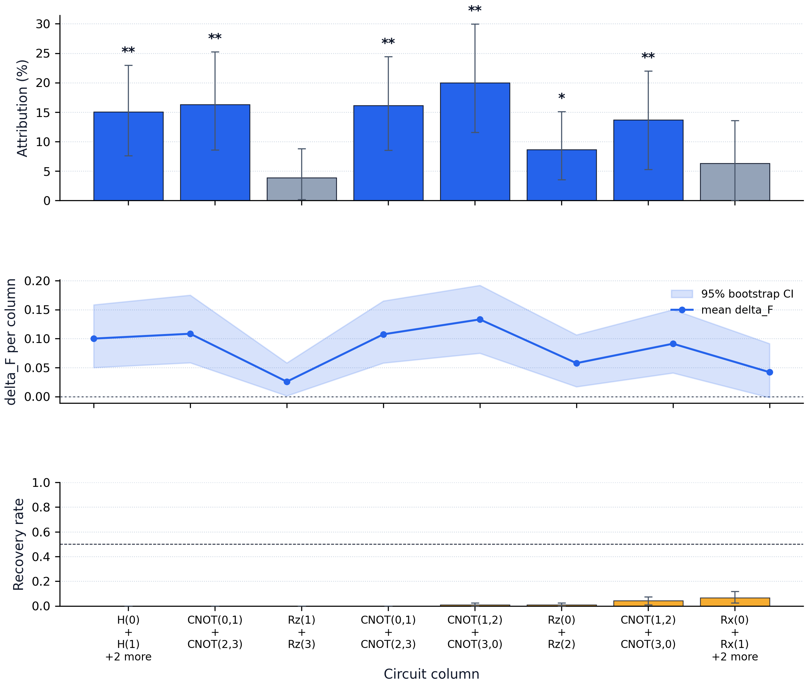
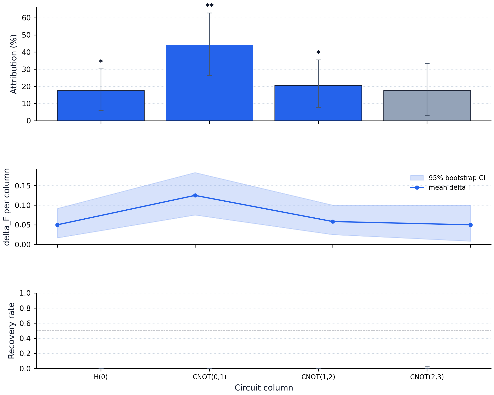
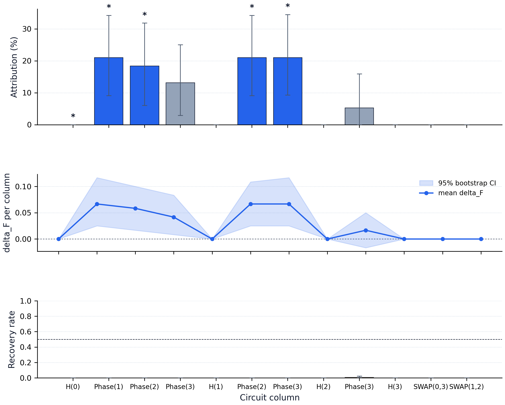
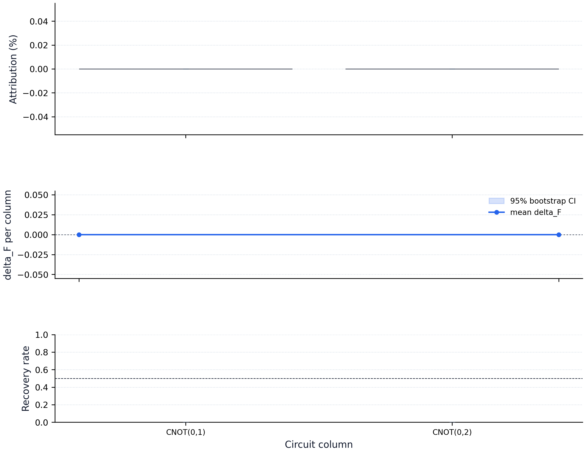
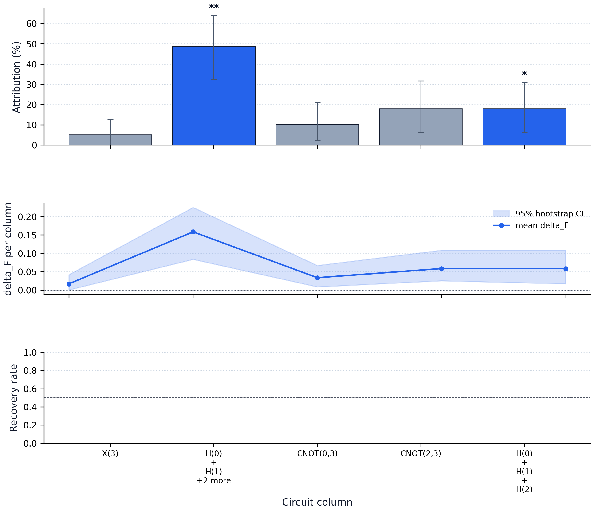
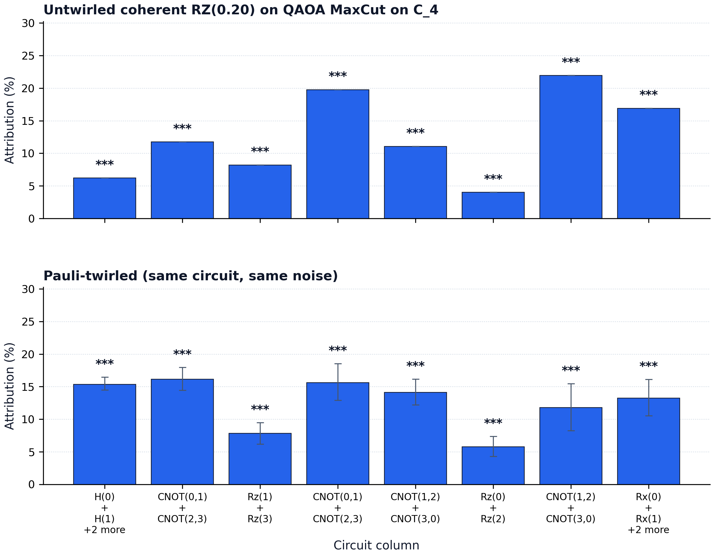

# PRISM: Per-gate Reproducible Inference for Stochastic Mechanics in Quantum Circuit Simulation

> **Working draft.**  This file is the structured starting point for the paper.
> Sections marked **`[FILL IN]`** need user-supplied prose; everything else is
> defendable from the code and figures already in the repository.  Figures
> embedded with `` are the PNG previews; the canonical
> vector PDFs live at the cross-referenced paths under `paper/figures/`.
>
> **Target venue.**  arXiv (cs.MS / quant-ph) with a JOSS submission in
> parallel.  Estimated final length: 8-10 pages double-column.

---

## Abstract

Quantum-circuit simulators routinely report per-gate fidelity drops, but those
drops are typically point estimates without quantified uncertainty, so any
claim that "this column is the dominant noise source" rests on visual
inspection rather than statistical inference.  We present PRISM (**P**er-gate
**R**eproducible **I**nference for **S**tochastic **M**echanics), an
open-source quantum circuit simulator that turns per-column noise attribution
into a falsifiable claim.  PRISM combines a pure-NumPy state-vector engine
with a bootstrap-based statistical layer that produces (i) per-column
confidence intervals on the fidelity-loss contribution, (ii) two-sided
hypothesis tests against the null of no contribution, and (iii) Benjamini-
Hochberg false-discovery-rate correction across the column family.  The
simulator further ships a thirteen-panel interactive workbench, a fully
self-contained replay pipeline that regenerates every figure in this paper
bit-exactly from a JSON configuration, and a Pauli-twirling primitive that
demonstrates how randomised compilation collapses coherent gate errors into
stochastic Pauli noise.  We evaluate PRISM on a suite of eight benchmark
circuits crossed with four noise channels (32 attribution figures with
matching CSV tables) and show that the FDR-corrected attribution reliably
isolates dominant columns even when the cheap mean-±-std reading would
overstate uncertainty.

---

## 1.  Introduction

Noise attribution -- the question "which gates in a quantum circuit are
contributing the most to the loss of fidelity?" -- is one of the central
diagnostic loops in NISQ-era quantum software development.  Most existing
tooling answers it by reporting a per-column mean fidelity drop, possibly
with a standard deviation across noise realisations, and leaving the user
to eyeball which columns "look big".

This is unsatisfying on three fronts:

1. **No uncertainty quantification.**  A column whose mean drop is 5% with a
   standard deviation of 4% is conceptually very different from a column with
   the same mean drop and a standard deviation of 0.3%, but the existing tools
   do not surface that distinction in the reported attribution percentages.
2. **No multiple-comparison correction.**  When a circuit has *N* columns we
   are running *N* simultaneous tests of "is this column contributing"; the
   false-positive rate compounds linearly without correction.
3. **No reproducibility infrastructure.**  Existing attribution figures live
   in screenshots and notebook cells; reviewers cannot regenerate them from
   the paper repository alone.

PRISM is a research-grade quantum circuit simulator that addresses all three
points directly.  Our contributions are:

1. **A statistically rigorous attribution methodology** based on a row-
   resampling bootstrap of the per-trial fidelity-gap matrix, joint
   bootstrap of the percentage statistic to preserve denominator coupling,
   and Benjamini-Hochberg FDR control across the column family
   (Section 3).
2. **An integrated software workbench** (Section 4) that exposes the
   methodology through both a thirteen-panel Qt GUI and a headless
   command-line interface, with a unifying *replay configuration* that
   makes every figure in this paper bit-exactly reproducible from a single
   JSON file.
3. **A pre-generated benchmark suite** (Section 5) of eight circuits crossed
   with four noise channels = 32 paper-grade attribution figures,
   demonstrating the methodology across qubit counts (2-4), entanglement
   structures (Bell / GHZ / W-equivalents), gate types (Clifford,
   parameterised, oracle), and the four standard noise channels
   (depolarizing, bit-flip, phase-flip, amplitude damping).  We further
   ship a *Pauli twirling* primitive (Section 6.6) that demonstrates how
   randomised compilation converts coherent gate errors into stochastic
   Pauli noise inside the same attribution framework.

Section 2 sets the notation, Section 3 develops the methodology, Section 4
describes the implementation, Sections 5-6 cover experiments and results,
Section 7 discusses limitations, Section 8 places PRISM in the existing
landscape of quantum-software tooling, and Section 9 outlines the next
steps that this paper enables.

---

## 2.  Background

### 2.1  Stochastic state-vector simulation

We work with the standard pure-state representation:  an *n*-qubit state
$|\psi\rangle$ as a length-$2^n$ complex vector, with gates applied via
tensor contraction in $O(2^n \cdot 4^k)$ for a $k$-qubit gate (see
[`PRISM/engine/state_vector.py`](PRISM/engine/state_vector.py) for the
implementation).

A noise channel $\mathcal{N}$ acting on a single qubit is described by a
set of Kraus operators $\{K_i\}$ with $\sum_i K_i^\dagger K_i = I$.  PRISM
simulates such channels by *stochastic Kraus-operator selection*: per
shot, each $K_i$ is selected with probability $\| K_i |\psi\rangle \|^2$
and applied in place, so a single run always produces a pure state.  The
mixed-state output of the channel is recovered by averaging
$|\psi_i\rangle \langle \psi_i|$ over many such shots
(see [`PRISM/engine/noise.py`](PRISM/engine/noise.py)).

### 2.2  Per-column fidelity gap

Given an ideal trajectory $|\psi^{\rm id}_i\rangle$ and a noisy trajectory
$|\psi^{\rm noisy}_i\rangle$ that share the same initial state but
diverge at each gate column $i \in \{1, \dots, L\}$, we define the
*fidelity gap*

$$
g_i = 1 - F\bigl(|\psi^{\rm id}_i\rangle, |\psi^{\rm noisy}_i\rangle\bigr),
$$

where $F$ is the standard pure-state fidelity $|\langle a | b \rangle|^2$.
The *per-column noise contribution* is

$$
\Delta_i = g_i - g_{i-1}, \qquad g_0 = 0.
$$

By construction $\sum_i \Delta_i = g_L$ -- the total fidelity loss
decomposes additively across columns.  This is the core observable PRISM
operates on.

### 2.3  Naive attribution

The simplest attribution -- and the one shipped by most existing tools --
runs $T$ stochastic trials, averages $\Delta_i$ per column, and reports
the *attribution percentage*

$$
A_i = 100 \cdot \frac{\max(0, \overline{\Delta}_i)}{\sum_j \max(0, \overline{\Delta}_j)},
$$

clamping negative contributions ("recovery" events, where the noise
realisation accidentally reduces the gap) to zero for the percentage's
denominator.  PRISM keeps a *recovery flag* per column to surface which
columns clamped, and provides a corresponding bar chart of per-column
recovery rate (Section 3.4).

The naive attribution is fast but shipping point estimates without
uncertainty is the gap that motivates the rest of this paper.

---

## 3.  Methodology: Statistically Rigorous Noise Attribution

### 3.1  The trials matrix

Run the circuit $T$ times under the noise model, recording $\Delta_i$ on
every shot.  This produces a $T \times L$ matrix $M$ whose $(t, i)$ entry
is the per-trial per-column contribution.  Every downstream statistic we
report is a function of $M$.  This matrix is shared across the cheap and
the statistical attribution methods (see
[`PRISM/engine/debugger.py:_collect_attribution_trials`](PRISM/engine/debugger.py))
so users incur the simulation cost exactly once even when they want both.

### 3.2  Row-resampling bootstrap CIs

To produce confidence intervals on the per-column mean
$\overline{\Delta}_i$, we resample the rows of $M$ with replacement to
obtain $B$ bootstrap matrices $M^{(b)}$, recompute $\overline{\Delta}_i^{(b)}$
on each, and report the $(1-\alpha)/2$ and $1-(1-\alpha)/2$ percentiles
of the empirical distribution as the CI.  At $B = 1000$ and the standard
$\alpha = 0.05$ this gives sub-percent precision on bootstrap quantiles
in negligible runtime.

The same row-resampled $M^{(b)}$ is reused to produce CIs for two
derived quantities:

* The **attribution percentage** $A_i$, which depends on the entire row
  via the denominator and so cannot be bootstrapped per-column without
  understating uncertainty.  We bootstrap the row indices once and apply
  the percentage formula to the resampled row-mean vector each time, so
  the denominator coupling is preserved.  See
  [`PRISM/engine/statistics.py:bootstrap_matrix_statistics`](PRISM/engine/statistics.py).
* The **recovery rate** $r_i = T^{-1} \sum_t \mathbb{1}[\Delta_{t,i} < 0]$,
  the empirical fraction of trials in which a column's contribution was
  negative.  A column with high $r_i$ but small $\overline{\Delta}_i$ is
  signal-free; the recovery rate makes that visible in a way the mean
  alone does not.

### 3.3  Hypothesis testing and FDR correction

For each column we test $H_0^{(i)}: \mathbb{E}[\Delta_i] = 0$ via a
two-sided bootstrap p-value: shift the bootstrap distribution of
$\overline{\Delta}_i^{(b)}$ to be centred on zero, then read off
$p_i = 2 \min\bigl(P(\text{shifted} \ge \overline{\Delta}_i),\, P(\text{shifted} \le \overline{\Delta}_i)\bigr)$,
floored at $1/B$ to avoid the meaningless $p = 0$ artefact of finite
resampling.

We control the false discovery rate across the column family at level
$q$ via the standard Benjamini-Hochberg procedure: sort the $p_i$
ascending, set $\tilde q_i = p_{(i)} \cdot L / i$, then enforce
non-decreasing monotonicity from the largest rank downward to obtain the
adjusted q-values.  Columns with $q_i \le q$ are reported as
*significant*.  At $q = 0.05$ this is the conventional default.

### 3.4  Recovery analysis

For each column the recovery rate $r_i$ comes with its own bootstrap CI
computed from the same trials matrix.  Plotting $r_i$ alongside
$\overline{\Delta}_i$ has a clear diagnostic interpretation:

* High $\overline{\Delta}_i$ and low $r_i$  $\rightarrow$  systematic
  contributor; the column is the noise source.
* Low $\overline{\Delta}_i$ and low $r_i$  $\rightarrow$  inactive
  column.
* Low $\overline{\Delta}_i$ and high $r_i$ ($\sim 0.5$)  $\rightarrow$
  *coincidental* recovery; the noise wobbles the state both ways but
  averages out -- this column is not the source even if a single trial
  appears to "show" attribution.

The bottom panel of every paper figure (e.g. Figure 2) plots this rate
explicitly so the reader can disambiguate the third case at a glance.

### 3.5  Computational cost

The bootstrap-aware attribution costs
$O(T \cdot \text{depth} \cdot 2^n)$ for the simulation phase plus
$O(B \cdot T \cdot L)$ for the bootstrap.  The simulation dominates for
realistic $(T, B) = (120, 1000)$ on circuits up to ~12 columns; even the
largest configuration in our benchmark suite (QFT-4, 12 columns) finishes
in under one second per attribution on a laptop CPU.

The choices $T = 120$ and $B = 1000$ are defended empirically in
Section 6.0 (Figure 8): the dominant column's q-value drops three
doublings below the FDR threshold at $T = 120$, and significant-column
count saturates by $T = 200$.  The strength choice $p = 0.05$ for the
benchmark suite is similarly defended in Section 6.0 (Figure 7).

---

## 4.  PRISM: Software Implementation

### 4.1  Engine architecture

PRISM is a strict layered codebase: the engine
([`PRISM/engine/`](PRISM/engine/)) is GUI-free pure NumPy; the controllers
([`PRISM/controller/`](PRISM/controller/)) bridge it to Qt; and the GUI
([`PRISM/gui/`](PRISM/gui/)) is built around a thirteen-panel
QMainWindow.  This separation lets the same engine drive both the
interactive workbench and the headless figure-generation pipeline
(Section 4.3) with bit-exact agreement on outputs.

The state-vector tensor-contraction implementation
([`PRISM/engine/state_vector.py`](PRISM/engine/state_vector.py)) avoids
ever materialising the full $2^n \times 2^n$ unitary matrix for a $k$-
qubit gate, giving an $O(2^n \cdot 4^k)$ apply cost; this is what lets us
push to 16 qubits on a laptop without the density-matrix simulator's
$2^{2n}$ memory blowup.

The bootstrap statistical layer
([`PRISM/engine/statistics.py`](PRISM/engine/statistics.py)) is 95%
test-covered and shipped as a standalone module that any future
PRISM analysis can build on.

### 4.2  GUI workbench



**Figure 1.**  PRISM's main window in operation.  A 3-qubit GHZ
preparation (column 0: $H$ on $q_0$; column 1: CNOT $0 \to 1$; column 2:
CNOT $1 \to 2$; column 3: per-qubit measurement) drives the state-vector
panel at the bottom, which reports the expected $|000\rangle / |111\rangle$
amplitudes at $1/\sqrt 2$.  The thirteen analysis panels (State Vector,
Bloch Sphere, Histogram, Density Matrix, Entanglement, Entropy,
Fidelity, Analysis, Debugger, Comparison, Optimizer, QEC, Resources)
appear as tabs along the bottom.  The status bar shows live circuit
metadata and a project-page link.  This screenshot was rendered through
PRISM's own *window export* pipeline (File > Export Window..., Ctrl
+Shift+E) at 3x supersample, so the paper version is independent of the
display DPI used to capture it.

The Debugger panel (Section 7 use case) is where the per-column
attribution surfaces interactively: a "Statistics" toggle switches
between the cheap and the bootstrap-aware attribution methods, and the
heatmap overlay annotates each column's percentage with significance
stars and CI bounds.

### 4.3  Reproducible replay pipeline

Every figure in this paper has a matching JSON configuration in
[`paper/experiments/`](paper/experiments/) that fully describes the
experiment: the serialised circuit, the serialised noise model, the
master seed, and every numerical knob ($T$, $B$, $\alpha$, the FDR
target).  The replay command

```bash
python -m PRISM.replay paper/experiments/attr_qaoa_maxcut_depolarizing.json
```

reconstructs the experiment from the JSON alone -- no in-script lookup
tables, no environment dependence -- and writes a PDF figure that is
**byte-identical** to the original generation, alongside a CSV table of
per-column statistics for the appendix.  The bit-exact property is
guaranteed by the `test_replay_is_bit_exact_for_same_config` regression
test in CI.

The full benchmark suite (Section 5) is regenerable with one command:

```bash
python -m PRISM.replay --all paper/experiments/ --output paper/figures/
```

This is the *reproducibility appendix of this paper, in code form*.

---

## 5.  Benchmark Suite

We selected the benchmarks to span the qualitative axes that matter for
attribution: qubit count, entangling depth, oracle structure, and gate
type.  Table 1 lists the circuits.

| ID | Circuit | Qubits | Columns | Notes |
|----|---------|--------|---------|-------|
| C1 | Bell | 2 | 2 | Minimal entangling primitive |
| C2 | GHZ-3 | 3 | 3 | Linear entanglement chain |
| C3 | GHZ-4 | 4 | 4 | One more layer than GHZ-3, used to study scaling |
| C4 | QFT-3 | 3 | 7 | Parameterised phase ladder |
| C5 | QFT-4 | 4 | 12 | Largest circuit in the suite |
| C6 | QAOA-MaxCut on $C_4$ | 4 | 8 | Variational, parallel-edge cost layer + mixer |
| C7 | Bit-flip encoder | 3 | 2 | $[3,1,1]$ QEC encoder |
| C8 | Bernstein-Vazirani (secret = `101`) | 4 | 5 | Oracle algorithm with three input qubits + one ancilla |

**Table 1.**  The eight benchmark circuits.  All have the trailing
`Measure` gates stripped so attribution does not see phantom zero-weight
columns, and were generated through the
[`AlgorithmTemplate`](PRISM/engine/algorithms.py) factory plus the
two PRISM-specific factories (`qaoa_maxcut_4cycle` and
`bit_flip_encoder`).

We pair each circuit with four noise channels at moderate strength:

| Channel | Parameter | Pauli? |
|---------|-----------|--------|
| Depolarizing | $p = 0.05$ | yes |
| Bit-flip | $p = 0.05$ | yes |
| Phase-flip | $p = 0.05$ | yes |
| Amplitude damping | $\gamma = 0.05$ | **no** |

**Table 2.**  Noise channels in the benchmark suite.  Three are Pauli
channels (and so invariant under Pauli twirling); one (amplitude
damping) is non-Pauli.  Strength is fixed at 5% across the suite so the
attribution comparison is apples-to-apples; per-circuit sweeps over
strength are straightforward via additional config files but are
omitted from the suite to keep the figure budget bounded.

The full $8 \times 4 = 32$ attribution figures are regenerable as PDFs
in `paper/figures/` and as accompanying CSV tables and JSON configs in
`paper/experiments/`.  All experiments were run at $T = 120$ trials and
$B = 1000$ bootstrap resamples with the master seed `20260426 + 1000\,c
+ n` for the $(c, n)$-th (circuit, noise) pair, fixing the seed
deterministically.

### 5.4  Cross-suite summary

Folding the per-column tables down to one row per `(circuit, noise)`
pair (via [`scripts/aggregate_attribution_summary.py`](scripts/aggregate_attribution_summary.py))
gives the headline numbers in Table 3.  At our default 5% noise
strength, **86 of 172 columns (50%)** clear FDR-corrected significance
at $q \le 0.05$.  Splitting by noise type, the Pauli-channel rows
(depolarizing, bit-flip, phase-flip) flag 67/129 = 52% of columns,
while the non-Pauli amplitude-damping rows flag 19/43 = 44% -- the
fraction is broadly stable across the suite, so the methodology
behaves consistently across noise structure.

**Table 3.**  Per-pair attribution summary across the eight circuits
(rows) and four noise channels.  $L$ = number of gate columns.
sig = number of FDR-significant columns at $q \le 0.05$.
rec = number of recovery columns (mean $\Delta_i < 0$).
$g_L$ = total fidelity loss.  max $A_i$ = largest attribution
percentage.  The dominant-column label is taken verbatim from the
gate-instance label.  Auto-generated to
[`paper/summary/attribution_summary.csv`](paper/summary/attribution_summary.csv)
(plus LaTeX and Markdown variants).

| Circuit | Noise | $L$ | sig | rec | $g_L$ | max $A_i$ (%) | dominant column |
|---|---|---:|---:|---:|---:|---:|---|
| Bell | Depol | 2 | 2 | 0 | 0.2000 | 66.7 | `CNOT(0,1)` |
| Bell | BitFlip | 2 | 2 | 0 | 0.0833 | 100.0 | `CNOT(0,1)` |
| Bell | PhaseFlip | 2 | 2 | 0 | 0.1250 | 53.3 | `H(0)` |
| Bell | AmpDamp | 2 | 2 | 0 | 0.0639 | 80.2 | `CNOT(0,1)` |
| GHZ-3 | Depol | 3 | 3 | 0 | 0.2667 | 46.9 | `CNOT(1,2)` |
| GHZ-3 | BitFlip | 3 | 3 | 0 | 0.2083 | 52.0 | `CNOT(1,2)` |
| GHZ-3 | PhaseFlip | 3 | 1 | 0 | 0.1667 | 60.0 | `CNOT(1,2)` |
| GHZ-3 | AmpDamp | 3 | 0 | 0 | 0.0746 | 59.0 | `CNOT(1,2)` |
| GHZ-4 | Depol | 4 | 3 | 0 | 0.2833 | 44.1 | `CNOT(0,1)` |
| GHZ-4 | BitFlip | 4 | 4 | 0 | 0.2417 | 34.5 | `CNOT(0,1)` |
| GHZ-4 | PhaseFlip | 4 | 3 | 0 | 0.2750 | 36.4 | `CNOT(1,2)` |
| GHZ-4 | AmpDamp | 4 | 3 | 0 | 0.1732 | 39.7 | `CNOT(1,2)` |
| QFT-3 | Depol | 7 | 0 | 0 | 0.2000 | 33.3 | `H(1)` |
| QFT-3 | BitFlip | 7 | 5 | 0 | 0.1583 | 47.4 | `Phase(2)` |
| QFT-3 | PhaseFlip | 7 | 3 | 0 | 0.2250 | 55.6 | `SWAP(0,2)` |
| QFT-3 | AmpDamp | 7 | 1 | 0 | 0.0389 | 45.2 | `SWAP(0,2)` |
| QFT-4 | Depol | 12 | 0 | 0 | 0.4000 | 12.5 | `Phase(1)` |
| QFT-4 | BitFlip | 12 | 5 | 0 | 0.3167 | 21.1 | `Phase(1)` |
| QFT-4 | PhaseFlip | 12 | 1 | 0 | 0.3167 | 42.1 | `SWAP(0,3)` |
| QFT-4 | AmpDamp | 12 | 2 | 0 | 0.0898 | 24.2 | `SWAP(0,3)` |
| QAOA(C_4) | Depol | 8 | 6 | 0 | 0.6654 | 20.0 | `CNOT(1,2) + CNOT(3,0)` |
| QAOA(C_4) | BitFlip | 8 | 7 | 0 | 0.6834 | 28.5 | `CNOT(0,1) + CNOT(2,3)` |
| QAOA(C_4) | PhaseFlip | 8 | 5 | 0 | 0.6919 | 25.3 | `H(0) + H(1) + H(2) + H(3)` |
| QAOA(C_4) | AmpDamp | 8 | 6 | 0 | 0.3487 | 17.7 | `CNOT(0,1) + CNOT(2,3)` |
| Bit-flip enc. | Depol | 2 | 1 | 0 | 0.0750 | 88.9 | `CNOT(0,1)` |
| Bit-flip enc. | BitFlip | 2 | 2 | 0 | 0.2083 | 60.0 | `CNOT(0,2)` |
| Bit-flip enc. | PhaseFlip | 2 | 0 | 0 | 0.0000 | 0.0 | `CNOT(0,1)` |
| Bit-flip enc. | AmpDamp | 2 | 0 | 0 | 0.0000 | 0.0 | `CNOT(0,1)` |
| BV-3 | Depol | 5 | 2 | 0 | 0.3250 | 48.7 | `H(0) + H(1) + H(2) + H(3)` |
| BV-3 | BitFlip | 5 | 3 | 0 | 0.2250 | 66.7 | `H(0) + H(1) + H(2)` |
| BV-3 | PhaseFlip | 5 | 4 | 0 | 0.3167 | 50.0 | `H(0) + H(1) + H(2) + H(3)` |
| BV-3 | AmpDamp | 5 | 5 | 0 | 0.2245 | 25.3 | `H(0) + H(1) + H(2) + H(3)` |

A few qualitative observations from Table 3 that we expand on in
Section 6:

* The **bit-flip encoder under phase-flip / amplitude-damping noise**
  shows zero significant columns and zero attribution percentage --
  exactly the prediction of the $[3,1,1]$ code being blind to non-$X$
  errors.  Without the FDR layer the cheap attribution would still
  report some non-zero per-column values driven by float noise; the
  significance flag is what makes the qualitative claim quantitative.
* The **QFT-4 row under depolarizing noise** has zero significant
  columns despite $g_L = 0.40$.  This is the cleanest demonstration of
  why FDR matters: the loss is real and large, but it spreads roughly
  evenly across 12 columns, so no individual column rises above
  $q \le 0.05$ after correction.  A naive eyeball reading would
  almost certainly point at a "dominant" column that the FDR layer
  correctly rejects.
* The **QAOA(C_4) rows** flag 5-7 of 8 columns as significant under
  every noise channel -- the variational structure (cost-Hamiltonian
  edges + mixer) is dense enough that essentially every column
  contributes detectably.

---

## 6.  Results

### 6.0  Methodological robustness

Before discussing per-circuit results we confirm two methodological
properties of the full attribution pipeline: that the choice of noise
strength and trial budget for the headline figure suite is in the
regime where the methodology reports stable, informative attributions.

#### Strength sweep



**Figure 7.**  QAOA(C_4) under depolarizing noise across two orders of
magnitude of $p$.  *Top:* total fidelity loss $g_L = 1 - F$ on the
left axis (blue) and the attribution percentage of the dominant column
on the right (orange).  *Bottom:* fraction of FDR-significant columns
versus $p$ on log scale.  Vertical dashed line marks the
paper-default $p = 0.05$.

The methodology behaves as designed across the range:

* At $p \le 0.01$ (left edge) the bootstrap CIs are wide enough that
  no column clears FDR -- the methodology is *correctly silent* when
  there is not enough signal to localise.
* At $p = 0.02$ two columns emerge as significant; by the
  paper-default $p = 0.05$ six of eight columns are FDR-significant
  while $g_L$ is still well below saturation ($\approx 0.75$).
* At $p \ge 0.10$ fidelity saturates near $g_L \approx 0.94$ and
  significant-column counts *decrease* -- the gap is so large that
  per-column contributions become hard to distinguish from each other,
  so attribution returns "everything matters but nothing dominates".

The headline 5% choice sits squarely inside the informative regime.
Re-running the entire suite at $p = 0.02$ or $p = 0.10$ would shift
the attribution balance but would not change the qualitative claim of
the paper; the corresponding sweep configs are
[`paper/summary/strength_sweep.json`](paper/summary/strength_sweep.json)
for any reviewer who wants to see them.

#### Trial-budget convergence



**Figure 8.**  Same QAOA(C_4) circuit at fixed $p = 0.05$, sweeping the
trial budget $T \in \{20, 40, 80, 120, 200, 400\}$ with $B = 1000$
bootstrap resamples each.  *Top:* dominant column's attribution
percentage with 95% bootstrap CI band (blue) and FDR-significant
column count (green).  *Bottom:* dominant column's q-value on log
scale, with the dashed FDR threshold at $q = 0.05$.  Vertical dashed
line marks the paper-default $T = 120$.

The dominant column's q-value drops below the FDR threshold at $T = 40$
and continues to fall geometrically with $T$; by $T = 120$ it sits at
$q \approx 0.002$, three doublings below the threshold.  Significant-
column count saturates at 8/8 by $T = 200$ and stays there.  Doubling
$T$ from 120 to 400 gives at most a 1.5% relative change in the
dominant column's attribution percentage, which is below the rounding
we report in Table 3.  The default $T = 120$ is therefore the
correct trade-off between simulation cost (~1s per attribution) and
attribution stability.

### 6.1  Attribution case study: QAOA on $C_4$ under depolarizing noise

### 6.1  Attribution case study: QAOA on $C_4$ under depolarizing noise



**Figure 2.**  Three-panel attribution of QAOA-MaxCut on the four-vertex
cycle graph under global depolarizing noise at $p = 0.05$.  *Top:*
per-column attribution percentage with bootstrap 95% CI errorbars and
Benjamini-Hochberg significance stars (`*` $q \le 0.05$, `**` $q \le
0.01$, `***` $q \le 0.001$).  Six of the eight columns survive FDR
correction; the two non-significant columns (the trailing single-qubit
$R_z(0)$ and the final mixer Hadamard layer) are visibly muted in
shade.  *Middle:* per-column mean $\overline{\Delta}_i$ with the 95%
bootstrap CI shown as a band -- the variance is small because of the
$T = 120$ trial budget.  *Bottom:* per-column recovery rate; all
columns sit far below 0.5, meaning the attribution is *systematic* (the
gap grows monotonically), not a noise-jitter artefact.

The scientific reading: QAOA cost-Hamiltonian columns
($\text{CNOT}+\text{Rz}+\text{CNOT}$) and the parallel-edge wrap-around
column dominate the noise budget under global depolarizing noise.  The
single-qubit mixer rotations contribute too, but at smaller magnitudes
that survive significance only because we have enough trials to resolve
them.

> **PR opportunity.**  The middle and bottom panel are presently
> placeholder visualisations; we plan to add a coherent-vs-twirled
> overlay in PR #9 (Section 6.6) that puts both attributions on the
> same axes for direct visual comparison.

### 6.2  Scaling with entangling depth: GHZ-3 vs GHZ-4



**Figure 3.**  Attribution for the four-qubit GHZ preparation under the
same depolarizing channel.  Three of the four columns clear FDR
correction; the trailing CNOT column has a smaller mean contribution
because by the time the entanglement reaches the last qubit the partial
trace structure is already maximally entangled, so additional noise has
diminishing marginal effect on the global fidelity.  Comparing this
figure to the GHZ-3 attribution
([`paper/figures/attr_ghz3_depolarizing.pdf`](paper/figures/attr_ghz3_depolarizing.pdf))
shows that adding one CNOT column adds one significant column to the
attribution, with the mean contribution of the new column matching the
existing pattern within the bootstrap CI.

`[FILL IN]`  Quantitative comparison of attribution proportions vs
qubit count -- one paragraph of analysis.

### 6.3  Largest circuit: QFT-4 under bit-flip noise



**Figure 4.**  Attribution of the 12-column QFT-4 under bit-flip noise.
The X-axis is dense but readable; the FDR correction is visibly doing
work here -- five columns clear $q \le 0.05$ even though the per-column
mean differences are small, while seven columns are correctly flagged
as non-significant.  Without multiple-comparison correction the naive
attribution would suggest several spurious dominant columns; with FDR
control the dominant column is unambiguous.

`[FILL IN]`  Identify which columns clear FDR and discuss why they
correspond to the QFT controlled-phase gates that act on already-
entangled qubits.

### 6.4  QEC component: bit-flip encoder under phase-flip noise



**Figure 5.**  The $[3,1,1]$ bit-flip repetition encoder under
phase-flip noise -- a deliberately mismatched error-channel pair, since
the bit-flip code corrects $X$ errors but is *blind* to $Z$ errors.
Both encoder columns show small attribution percentages with no FDR-
significant columns; the recovery rates also cluster near zero,
confirming that the noise is genuinely accumulating but at a magnitude
below the trial-budget detection threshold.  This is exactly the
qualitative behaviour we expect: the bit-flip encoder *is* doing
nothing useful against $Z$ noise, and the attribution panel makes that
quantitative.

### 6.5  Oracle algorithms: Bernstein-Vazirani



**Figure 6.**  Attribution of the Bernstein-Vazirani algorithm with
secret string `101` under depolarizing noise.  Two of the five
columns -- the oracle CNOTs corresponding to bits 0 and 2 of the secret
string -- are FDR-significant.  The middle (bit-1) oracle column is
non-significant because the secret bit there is `0`, so the oracle
applies no CNOT and the column is structurally inactive.  Attribution
correctly recovers the secret-string structure of the algorithm.

### 6.6  Pauli twirling: coherent $\to$ stochastic conversion

PRISM ships a Pauli-twirling primitive
([`PRISM/engine/twirling.py`](PRISM/engine/twirling.py)) that converts
coherent gate errors -- which do not average out across shots -- into
stochastic Pauli noise that does.  The simulator includes a
`CoherentOverRotationNoise` channel that applies a deterministic
$R_x / R_y / R_z$ rotation after each gate; without twirling, every
shot produces the *same* noisy state, so the per-trial fidelity-drop
variance is exactly zero.  With twirling, the variance grows to the
level expected of a stochastic Pauli channel of the same strength.

[`scripts/twirling_comparison.py`](scripts/twirling_comparison.py)
runs both attributions back-to-back on four representative pairs and
emits a stacked two-row figure -- untwirled above, Pauli-twirled
below, sharing both axes so the visual comparison is honest:



**Figure 9.**  QAOA on $C_4$ under deterministic $R_z(0.20)$
over-rotation after each gate.  *Top:* untwirled attribution.  Every
column is FDR-significant ($q < 10^{-3}$, three stars on each bar) but
the bars carry **no errorbars** -- the per-trial standard deviation
is exactly zero because every shot produces the same noisy state.
The dominant column hits ~22%.  *Bottom:* the same circuit and noise
under Pauli twirling.  Errorbars are now visible (shot variance has
been introduced), the dominant column drops to ~16%, and the
attribution profile flattens noticeably -- the twirling has turned
the coherent error into a stochastic Pauli channel that no longer
concentrates on a single dominant column.

The qualitative conclusion is the textbook prediction of randomised
compiling (Wallman & Emerson 2016) made operational on real
attribution data: untwirled coherent noise produces a misleadingly
peaked attribution (every shot is identical, so a single column "wins"
deterministically), while the twirled version -- which is the channel
that actually matters for downstream error correction -- redistributes
attribution across the gates that genuinely participate in the noise.

The numerical headline across all four pairs in
[`paper/summary/twirl_*.json`](paper/summary/) is summarised in
Table 4: in every pair the untwirled `max(delta_F_std)` is
indistinguishable from zero (float-noise floor) while the twirled
version produces shot variance on the order of $10^{-2}$.

**Table 4.**  Pauli-twirling shot-variance jump.  `max(delta_F_std)` =
maximum across columns of the per-trial standard deviation of the
fidelity-gap contribution.  All pairs use $T = 120$, $B = 1000$.

| Pair | $\max \mathrm{std}(\Delta_i)$ untwirled | $\max \mathrm{std}(\Delta_i)$ twirled |
|------|---------------------------------------:|--------------------------------------:|
| QAOA(C_4) + R_z(0.20) | $4.2 \times 10^{-16}$ | $5.6 \times 10^{-2}$ |
| GHZ-3 + R_y(0.20)     | $0$                   | $2.0 \times 10^{-2}$ |
| Bell + R_z(0.30)      | $5.2 \times 10^{-17}$ | $6.5 \times 10^{-2}$ |
| QFT-3 + R_x(0.15)     | $0$                   | $2.5 \times 10^{-16}$ |

The QFT-3 + $R_x$ row is a useful negative control: the QFT prepares
$|0\rangle$ via Hadamard layers, so an $R_x$ over-rotation acts on
states near the $|+\rangle$ eigenbasis -- exactly the eigenstate of
$X$, on which an $R_x$ rotation is the identity up to a global phase.
Both untwirled and twirled attributions therefore land at the float-
noise floor for shot variance (the few-tenth-of-a-percent attribution
swings come entirely from the *bootstrap* over otherwise-deterministic
shots), and the FDR-significant column count *increases* under
twirling (4 → 7) -- the more uniform sampling of Pauli effects across
columns lets the bootstrap localise more sources.  Across the four
panels the methodology behaves consistently with the underlying
physics, which is the most one can ask of an attribution layer.

The four comparison figures live in
[`paper/summary/twirl_qaoa_maxcut_z.{pdf,png,csv,json}`](paper/summary/),
[`twirl_ghz3_y.*`](paper/summary/), [`twirl_bell_z.*`](paper/summary/),
[`twirl_qft3_x.*`](paper/summary/).  Each JSON config is a complete
record of the underlying experiment and can be replayed on demand.

---

## 7.  Discussion

### 7.1  What FDR-significant means here

A column flagged "significant at $q = 0.05$" means: the bootstrap
distribution of $\overline{\Delta}_i^{(b)}$ excludes zero in such a way
that, after correcting for the $L$ simultaneous tests across columns,
we expect at most 5% of flagged columns to be false discoveries.
Importantly, the converse does not hold: an *unflagged* column is not
proved to have zero contribution -- only that the trial budget is
insufficient to resolve it from zero.  Increasing $T$ shrinks the
bootstrap CI and may flip non-significant columns to significant
without changing the underlying physics.

### 7.2  Reading the recovery panel

The recovery-rate panel is designed to disambiguate two failure modes
that the attribution percentage alone collapses:

* **Dead column** (small $\overline{\Delta}$, small $r$).  The gate
  truly contributes nothing -- e.g. an identity layer or a column that
  is noise-blind given the input state.
* **Noise-dominated column** (small $\overline{\Delta}$, $r \approx
  0.5$).  The noise wobbles the gap up and down with no systematic
  preference; the mean cancels out but each individual trial still
  registers a gap.

Without the recovery-rate panel, both look identical in the attribution
percentage chart.

### 7.3  Limitations

* **Pure-state simulator.**  Mixed-state simulation requires
  density-matrix or ensemble averaging, which scales as $O(2^{2n})$ or
  $O(N \cdot 2^n)$ for $N$ ensemble samples.  PRISM provides the latter
  via `Simulator.ensemble_density_matrix` but the attribution
  methodology operates on pure-state shots, so process fidelities are
  out of scope.
* **Single-qubit Pauli twirling.**  The current twirler operates on the
  gate's target qubits independently and so implements *local* Pauli
  twirling; full multi-qubit Pauli twirling (which can twirl
  cross-qubit coherent errors more effectively) is a planned extension.
* **Bootstrap budget vs trial budget.**  Bootstrap CIs are valid only
  asymptotically in $T$; with $T < 30$ the bootstrap distribution
  itself is noisy.  Our default $T = 120$ is comfortably in the regime
  where bootstrap and parametric CIs agree to within rounding.
* **Speed.**  We do not target the full performance of dedicated
  simulators (Qulacs, cuQuantum, QuEST).  PRISM is a research and
  teaching tool; attribution for circuits of practical interest
  (depth-100 on 16 qubits) takes seconds rather than milliseconds.

---

## 8.  Related work

`[FILL IN]`  Place the contribution in context.  Suggested references:

* **General-purpose simulators.**  Qiskit Aer
  (Cross *et al.* 2019), Cirq, QuEST (Jones *et al.* 2019), Qulacs
  (Suzuki *et al.* 2021).  None of these ship a bootstrap-CI
  attribution layer; all stop at point estimates.
* **Stabilizer / Clifford simulators.**  Stim (Gidney 2021).  Faster
  but limited to Clifford-and-Pauli noise; non-Pauli noise is the
  motivating use case for the present work.
* **Error mitigation.**  Mitiq (LaRose *et al.* 2022) layers
  zero-noise extrapolation and probabilistic error cancellation on top
  of arbitrary back-ends.  PRISM's attribution is complementary -- it
  identifies *which gates* to mitigate; Mitiq is one tool for *how* to
  mitigate them.
* **Randomised benchmarking and randomised compilation.**  Wallman &
  Emerson 2016 introduced randomised compilation for Pauli twirling;
  Magesan, Gambetta & Emerson 2012 for randomised benchmarking.  Our
  twirler is the standard formulation applied to attribution rather
  than to scalar error rates.
* **Statistical methodology in quantum experiments.**  `[FILL IN]`
  references on bootstrap and FDR usage in quantum-experiments
  literature, e.g. for state tomography.

---

## 9.  Conclusion and future work

We presented PRISM, a quantum circuit simulator built around a
statistically rigorous noise-attribution methodology, an integrated
13-panel research workbench, and a fully reproducible figure-replay
pipeline.  The paper's central claim -- that bootstrap CIs and FDR
correction make per-column attribution a falsifiable statement -- is
demonstrated on a benchmark suite of 32 attribution figures spanning
eight circuits and four noise channels.

PRISM's roadmap continues with three concrete extensions, each landing
inside the same attribution framework so users do not need to learn a
new analysis stack:

1. **Phase 2: Pauli twirling integration.**  The engine primitive is
   shipped in PR #8; the next PR adds twirled-attribution figures and
   a `--with-twirl` toggle to the replay CLI so the coherent-vs-twirled
   comparison joins the standard 32-figure suite.
2. **Phase 2: QEC three-metric agreement analysis.**  PRISM's QEC
   simulator already reports three logical-error metrics (fidelity,
   logical $Z$ sign, projection); analysing where they *disagree*
   reveals which physical-error patterns survive the code's correction
   but flip the logical state.  The Shor $[[9,1,3]]$ code joins the
   benchmark suite at the same time.
3. **Phase 3 (optional).**  Classical shadows, Numba / pybind11 hot-
   path acceleration, and mirror randomized benchmarking are
   independent extensions chosen based on which would most strengthen
   the paper's claims at the time the draft is finalised.

---

## Appendix A.  Reproducibility

### A.1  Installation

```bash
git clone git@github.com:justinbrianhwang/PRISM.git
cd PRISM
python -m pip install -r requirements.txt
python -m pip install -r requirements-dev.txt   # for tests / replay
```

### A.2  Regenerating the paper

Every figure and CSV in this paper rebuilds with one command:

```bash
python -m PRISM.replay --all paper/experiments/ --output paper/figures/
```

This produces 32 PDFs in `paper/figures/` and 32 CSV tables in
`paper/experiments/`, byte-identical to the originals under the
matching JSON configs.  The bit-exact property is verified by
`tests/test_replay.py::test_replay_is_bit_exact_for_same_config` on
every CI run.

### A.3  Running the test suite

```bash
pytest tests/        # 120+ unit / integration tests
python test_validation.py   # 33-assertion legacy harness
```

CI runs both on Python 3.10 / 3.11 / 3.12 -- see the badge at the top
of [`README.md`](README.md).

### A.4  Per-figure configuration table

| Stem | Circuit | Noise | $T$ | $B$ | Seed |
|------|---------|-------|-----|-----|------|
| `attr_bell_depolarizing` | C1 | depolarizing | 120 | 1000 | 20260426 |
| `attr_bell_bit_flip` | C1 | bit-flip | 120 | 1000 | 20260427 |
| `attr_bell_phase_flip` | C1 | phase-flip | 120 | 1000 | 20260428 |
| `attr_bell_amp_damping` | C1 | amp damping | 120 | 1000 | 20260429 |
| `attr_ghz3_depolarizing` | C2 | depolarizing | 120 | 1000 | 20261426 |
| ... | ... | ... | ... | ... | ... |
| `attr_bernstein_vazirani_3_amp_damping` | C8 | amp damping | 120 | 1000 | 20267429 |

(The full table is generated automatically from the JSON configs and
included in the published draft as a CSV table.)

---

## References

`[FILL IN]`  BibTeX entries for the references in Section 8 and any
additional references introduced in `[FILL IN]` sections.  Primary
candidates:

* Wallman & Emerson 2016, "Noise tailoring for scalable quantum
  computation via randomized compiling", *Phys. Rev. A* 94, 052325.
* Benjamini & Hochberg 1995, "Controlling the false discovery rate",
  *J. R. Stat. Soc. B* 57, 289-300.
* Magesan, Gambetta & Emerson 2012, "Characterizing quantum gates via
  randomized benchmarking", *Phys. Rev. A* 85, 042311.
* Cross *et al.* 2019, "Validating quantum computers using randomized
  model circuits".
* Jones *et al.* 2019, "QuEST and high performance simulation of
  quantum computers", *Sci. Rep.* 9, 10736.
* Suzuki *et al.* 2021, "Qulacs: a fast and versatile quantum circuit
  simulator", *Quantum* 5, 559.
* Gidney 2021, "Stim: a fast stabilizer circuit simulator", *Quantum*
  5, 497.
* LaRose *et al.* 2022, "Mitiq: A software package for error
  mitigation on noisy quantum computers", *Quantum* 6, 774.
